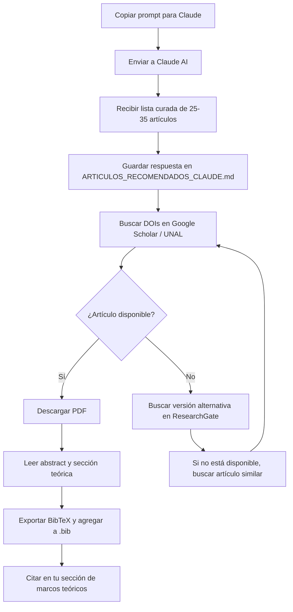

# 🎯 PROMPT PARA BÚSQUEDA DE BIBLIOGRAFÍA: MARCOS TEÓRICOS

## 📋 CONTEXTO DE TU SECCIÓN ACTUAL

Actualmente tienes identificados:

- ✅ Marco de diseño de tareas (Radmehr 2023, Canoğulları 2025)
- ✅ Demanda cognitiva (Stein - Mathematical Tasks Framework)
- ✅ Representaciones múltiples (Henríquez-Rivas 2023)

**PERO TE FALTAN** los marcos teóricos fundacionales clásicos de:

- Teoría de Situaciones Didácticas (Brousseau)
- Teoría de Registros Semióticos (Duval)
- Aprendizaje Significativo (Ausubel/Novak)
- Teoría Sociocultural (Vygotsky aplicada a matemáticas)
- Conocimiento Didáctico del Contenido (Shulman/Ball)

---

## 🔍 PROMPT PARA GOOGLE SCHOLAR / BASES DE DATOS

### **PROMPT 1: Teorías Didácticas Fundacionales**

```
BUSCAR en Google Scholar:

("theory of didactical situations" OR "teoría de situaciones didácticas")
AND ("Guy Brousseau" OR "Brousseau")
AND ("mathematics education" OR "educación matemática")
[Filtrar: 1980-2025]

OBJETIVO: Encontrar textos fundacionales y aplicaciones contemporáneas de la teoría de Brousseau

SEÑALES DE CALIDAD:
- Citado más de 100 veces
- Publicado en Educational Studies in Mathematics, ZDM, RELIME
- Conceptos clave mencionados: milieu didactique, contrat didactique, situations a-didactiques, dévolution
```

### **PROMPT 2: Registros de Representación Semiótica**

```
BUSCAR en Google Scholar:

("semiotic representation" OR "registros de representación semiótica" OR "registers of representation")
AND ("Raymond Duval" OR "Duval")
AND ("trigonometry" OR "functions" OR "trigonométricas")
[Filtrar: 1990-2025]

OBJETIVO: Teoría de Duval aplicada específicamente a funciones y trigonometría

SEÑALES DE CALIDAD:
- Menciona: tratamiento, conversión, coordinación de registros
- Aplicación a funciones trigonométricas o transición entre representaciones
- Publicado en journals de didáctica de matemáticas
```

### **PROMPT 3: Aprendizaje Significativo con Tecnología**

```
BUSCAR en Google Scholar:

("meaningful learning" OR "aprendizaje significativo")
AND ("Ausubel" OR "Novak")
AND ("technology" OR "digital tools" OR "tecnología")
AND ("mathematics" OR "matemáticas")
[Filtrar: 2000-2025]

OBJETIVO: Aplicaciones modernas de aprendizaje significativo con herramientas digitales

SEÑALES DE CALIDAD:
- Menciona: organizadores previos, subsumidores, estructura cognitiva
- Integración con tecnologías educativas
- Estudios empíricos o revisiones teóricas
```

### **PROMPT 4: Demanda Cognitiva de Tareas (complementar)**

```
BUSCAR en Google Scholar:

("cognitive demand" OR "demanda cognitiva")
AND ("mathematical tasks" OR "tareas matemáticas")
AND ("Stein" OR "Smith")
AND ("implementation" OR "decline" OR "mantenimiento")
[Filtrar: 1996-2025]

OBJETIVO: Textos originales de Stein y aplicaciones recientes del MTF

ARTÍCULOS CLAVE A BUSCAR:
- Stein & Smith (1998) "Mathematical tasks as a framework for reflection"
- Stein et al. (2000) "Implementing standards-based mathematics instruction"
- Stein & Lane (1996) "Instructional tasks and the development of student capacity"
```

### **PROMPT 5: Conocimiento Didáctico del Contenido**

```
BUSCAR en Google Scholar:

("pedagogical content knowledge" OR "conocimiento didáctico del contenido")
AND ("mathematics" OR "matemáticas")
AND ("Shulman" OR "Ball" OR "Hill" OR "Mathematical Knowledge for Teaching")
[Filtrar: 1986-2025]

OBJETIVO: Marco teórico sobre el conocimiento que necesita un docente de matemáticas

CONCEPTOS CLAVE:
- PCK (Pedagogical Content Knowledge)
- MKT (Mathematical Knowledge for Teaching)
- SCK (Specialized Content Knowledge)
- KCS (Knowledge of Content and Students)
```

### **PROMPT 6: Teoría Sociocultural en Matemáticas**

```
BUSCAR en Google Scholar:

("sociocultural theory" OR "teoría sociocultural")
AND ("Vygotsky" OR "zona de desarrollo próximo" OR "ZPD")
AND ("mathematics education" OR "educación matemática")
AND ("scaffolding" OR "mediación")
[Filtrar: 1980-2025]

OBJETIVO: Fundamentos socioculturales del aprendizaje matemático

TÉRMINOS RELACIONADOS:
- Zona de Desarrollo Próximo (ZDP/ZPD)
- Andamiaje (scaffolding)
- Mediación semiótica
- Instrumentación (Rabardel, Vérillon)
```

### **PROMPT 7: Integración Tecnológica (TPACK)**

```
BUSCAR en Google Scholar:

("TPACK" OR "Technological Pedagogical Content Knowledge")
AND ("mathematics" OR "matemáticas")
AND ("Mishra" OR "Koehler" OR "Niess")
[Filtrar: 2006-2025]

OBJETIVO: Marco teórico sobre integración de tecnología en enseñanza de matemáticas

ARTÍCULO FUNDACIONAL:
- Mishra & Koehler (2006) "Technological pedagogical content knowledge: A framework for teacher knowledge"
```

### **PROMPT 8: Ingeniería Didáctica**

```
BUSCAR en Google Scholar:

("didactical engineering" OR "ingeniería didáctica" OR "ingénierie didactique")
AND ("Artigue" OR "Chevallard")
AND ("mathematics" OR "matemáticas")
[Filtrar: 1988-2025]

OBJETIVO: Metodología de diseño e investigación en didáctica de matemáticas

AUTORES CLAVE:
- Michèle Artigue (ingeniería didáctica)
- Yves Chevallard (transposición didáctica)
```

### **PROMPT 9: Teoría de la Variación**

```
BUSCAR en Google Scholar:

("variation theory" OR "teoría de la variación")
AND ("mathematics" OR "matemáticas")
AND ("Marton" OR "Runesson" OR "Watson")
[Filtrar: 1990-2025]

OBJETIVO: Teoría sobre cómo el contraste y la variación facilitan el aprendizaje

APLICACIÓN:
- Diseño de secuencias de tareas con variación sistemática
- Patterns of variation
- Critical features
```

### **PROMPT 10: Espacios de Trabajo Matemático**

```
BUSCAR en Google Scholar:

("mathematical working space" OR "espacio de trabajo matemático" OR "ETM")
AND ("Kuzniak" OR "Richard")
AND ("geometry" OR "trigonometry" OR "functions")
[Filtrar: 2006-2025]

OBJETIVO: Marco para analizar cómo estudiantes trabajan con objetos matemáticos

APLICACIÓN A TRIGONOMETRÍA:
- Coordinación entre planos (epistemológico, cognitivo)
- Génesis instrumental, discursiva, semiótica
```

---

## 🎯 ESTRATEGIA DE BÚSQUEDA POR PRIORIDADES

### **FASE 1: Fundacionales (Semana 1)** ⭐⭐⭐

Buscar en este orden:

1. Brousseau (Teoría de Situaciones Didácticas)
2. Duval (Registros Semióticos)
3. Ausubel/Novak (Aprendizaje Significativo)
4. Stein & Smith (Demanda Cognitiva - textos originales)

**Meta**: 4-6 referencias fundacionales sólidas

### **FASE 2: Complementarios (Semana 2)** ⭐⭐

5. Vygotsky/teoría sociocultural aplicada a matemáticas
6. TPACK (Mishra & Koehler)
7. PCK/MKT (Shulman/Ball)

**Meta**: 3-4 referencias de marcos complementarios

### **FASE 3: Especializados (Semana 3)** ⭐

8. Ingeniería Didáctica (Artigue)
9. Teoría de la Variación (Marton/Watson)
10. Espacios de Trabajo Matemático (Kuzniak)

**Meta**: 2-3 referencias de marcos especializados opcionales

---

## 📚 BASES DE DATOS RECOMENDADAS POR PROMPT

| Prompt                 | Base de datos prioritaria               | Alternativas           |
| ---------------------- | --------------------------------------- | ---------------------- |
| 1-2 (Brousseau, Duval) | JSTOR, SpringerLink                     | Google Scholar, ERIC   |
| 3 (Ausubel)            | PsycINFO, ERIC                          | Google Scholar, SciELO |
| 4 (Stein)              | ERIC, JSTOR                             | Google Scholar         |
| 5 (PCK/MKT)            | ERIC, AERA journals                     | Google Scholar         |
| 6 (Vygotsky)           | JSTOR, SpringerLink                     | Google Scholar         |
| 7 (TPACK)              | ERIC, Computers & Education             | Google Scholar         |
| 8-10 (Especializados)  | ZDM, Educational Studies in Mathematics | RELIME                 |

---

## 🔎 TÉRMINOS DE BÚSQUEDA ALTERNATIVOS

Si no encuentras resultados, prueba estos términos equivalentes:

**Teoría de Situaciones Didácticas:**

- "didactic situations"
- "adidactical situations"
- "milieu theory"
- "didactic contract"

**Registros Semióticos:**

- "semiotic registers"
- "representation systems"
- "conversion and treatment"
- "registers of representation"

**Aprendizaje Significativo:**

- "meaningful learning theory"
- "subsumers"
- "advance organizers"
- "cognitive structure"

**Demanda Cognitiva:**

- "task complexity"
- "cognitive level"
- "mathematical task framework"
- "levels of demand"

---

## 💡 TIPS PARA IDENTIFICAR BUENOS ARTÍCULOS

### ✅ SEÑALES POSITIVAS:

- [ ] Citado más de 50-100 veces (para teorías fundacionales: >500)
- [ ] Publicado en journals Q1/Q2 (Educational Studies in Mathematics, ZDM, Journal for Research in Mathematics Education)
- [ ] Incluye aplicaciones empíricas o ejemplos concretos
- [ ] Menciona explícitamente los constructos teóricos clave
- [ ] Tiene sección de "theoretical framework" bien desarrollada

### ❌ SEÑALES NEGATIVAS:

- [ ] Solo menciona la teoría de pasada sin profundizar
- [ ] No hay citas a autores fundacionales
- [ ] Publicado en journals sin revisión por pares
- [ ] Abstract vago sin conceptos teóricos específicos
- [ ] Enfoque exclusivamente práctico sin fundamentación teórica

---

## 📝 TEMPLATE PARA REGISTRAR TUS HALLAZGOS

Crea un documento con este formato para cada referencia encontrada:

```markdown
## [AUTOR(ES) - AÑO]

**Título**:
**Journal/Libro**:
**DOI/URL**:
**Citado por**: [número]

### Marco Teórico Principal:

- [ ] Brousseau
- [ ] Duval
- [ ] Ausubel
- [ ] Stein
- [ ] Vygotsky
- [ ] TPACK
- [ ] Otro: \***\*\_\_\_\*\***

### Conceptos Clave Mencionados:

### Aplicabilidad a tu Investigación:

(¿Cómo puedes usar esta referencia en tu sección de marcos teóricos?)

### Cita clave (para usar directamente):

### Notas adicionales:

---
```

---

## 🚀 PROMPT INTEGRADOR (BÚSQUEDA AVANZADA)

Si quieres hacer una búsqueda que combine múltiples marcos:

```
BUSCAR en Google Scholar:

("didactical situations" OR "semiotic registers" OR "meaningful learning")
AND ("task design" OR "diseño de tareas")
AND ("mathematics education" OR "educación matemática")
AND ("theoretical framework" OR "marco teórico")
[Filtrar: 2010-2025]

OBJETIVO: Artículos que integran múltiples marcos teóricos para diseño de tareas

IDEAL PARA: Ver cómo otros investigadores han articulado diferentes teorías
```

---

## 📊 CHECKLIST FINAL DE MARCOS TEÓRICOS PARA TU SECCIÓN

Después de tus búsquedas, verifica que tengas al menos:

### Marcos Fundacionales (MÍNIMO 3-4):

- [ ] Teoría de Situaciones Didácticas (Brousseau)
- [ ] Registros de Representación Semiótica (Duval)
- [ ] Aprendizaje Significativo (Ausubel)
- [ ] Demanda Cognitiva/MTF (Stein & Smith)

### Marcos Complementarios (MÍNIMO 2-3):

- [ ] Teoría Sociocultural (Vygotsky aplicado a matemáticas)
- [ ] TPACK (integración tecnológica)
- [ ] PCK/MKT (conocimiento docente)

### Marcos Opcionales Especializados (AL MENOS 1):

- [ ] Ingeniería Didáctica (Artigue)
- [ ] Teoría de la Variación (Marton)
- [ ] Espacios de Trabajo Matemático (Kuzniak)
- [ ] Instrumental Genesis (Rabardel/Trouche)

---

## 🎓 RECURSOS ADICIONALES

### Revistas especializadas donde encontrarás estos marcos:

1. **Educational Studies in Mathematics** (Springer)
2. **ZDM Mathematics Education** (Springer)
3. **Journal for Research in Mathematics Education** (NCTM)
4. **International Journal of Science and Mathematics Education** (Springer)
5. **RELIME** (Revista Latinoamericana de Investigación en Matemática Educativa)
6. **Revista Colombiana de Educación**
7. **Enseñanza de las Ciencias**

### Libros clave a consultar:

- Brousseau, G. (2002). _Theory of Didactical Situations in Mathematics_
- Duval, R. (2006). _A Cognitive Analysis of Problems of Comprehension in a Learning of Mathematics_
- Artigue, M. et al. (2007). _Connecting research to teaching_
- Stein, M. K., & Smith, M. S. (2011). _5 Practices for Orchestrating Productive Mathematics Discussions_

---

## ⚡ ACCIÓN INMEDIATA RECOMENDADA

**HOY (30 minutos)**:

1. Ejecuta PROMPT 1 (Brousseau) en Google Scholar
2. Descarga los 3 artículos más citados
3. Lee solo los abstracts y secciones de "theoretical framework"

**ESTA SEMANA (3-4 horas)**:

1. Ejecuta PROMPTS 1-4 (fundacionales)
2. Selecciona 1-2 referencias por cada marco
3. Lee las secciones teóricas completas
4. Registra citas clave en tu documento .bib

**PRÓXIMA SEMANA (2-3 horas)**:

1. Ejecuta PROMPTS 5-7 (complementarios)
2. Selecciona 1 referencia por marco
3. Integra en tu sección de marcos teóricos

---

## 📌 NOTA FINAL

Este prompt está diseñado para **búsqueda dirigida y eficiente**. No intentes leer todo de inmediato. La estrategia es:

1. **Buscar** → Usa los prompts específicos
2. **Filtrar** → Usa las señales de calidad
3. **Seleccionar** → Elige 1-2 refs por marco
4. **Leer estratégicamente** → Solo secciones teóricas
5. **Citar** → Agrega a tu .bib y a tu texto

¡Con esta estrategia, en 2-3 semanas tendrás una sección de marcos teóricos sólida y bien fundamentada! 🎯

---

# 🤖 PROMPT PARA CLAUDE AI - BÚSQUEDA DE ARTÍCULOS

## Copy-paste este prompt directamente en Claude:

---

```
Soy estudiante de maestría en educación matemática de la Universidad Nacional de Colombia y estoy desarrollando mi tesis sobre:

**TEMA DE INVESTIGACIÓN:**
"Diseño de tareas matemáticas que integran inteligencia artificial para la enseñanza de funciones trigonométricas en estudiantes de educación media"

**CONTEXTO DE MI INVESTIGACIÓN:**
- Trabajo con estudiantes de educación media (15-17 años)
- Integro herramientas de IA (como GeoGebra con componentes de IA, ChatGPT, etc.) en el diseño de tareas matemáticas
- Me enfoco específicamente en funciones trigonométricas (seno, coseno, tangente)
- Busco entender cómo diseñar tareas que aprovechen la IA para mejorar la comprensión conceptual
- Interesado en representaciones múltiples, demanda cognitiva y aprendizaje significativo

**MARCOS TEÓRICOS QUE YA IDENTIFICO:**
1. Marco de diseño de tareas (Radmehr 2023, Canoğulları 2025)
2. Mathematical Tasks Framework - Demanda cognitiva (Stein & Smith)
3. Múltiples representaciones (Henríquez-Rivas 2023)
4. Revisión sistemática de IA en educación matemática (Hariyanto 2025)

**LO QUE NECESITO:**
Quiero fortalecer mi sección de "Identificación de marcos teóricos" con referencias fundacionales y contemporáneas sobre:

**MARCOS TEÓRICOS PRIORITARIOS:**

1. **Teoría de Situaciones Didácticas (Guy Brousseau)**
   - Necesito artículos clave o capítulos de libro donde Brousseau explique:
     - Situaciones a-didácticas
     - Contrato didáctico
     - Milieu didactique
     - Dévolution
   - Preferiblemente aplicados a enseñanza de funciones o trigonometría

2. **Teoría de Registros de Representación Semiótica (Raymond Duval)**
   - Necesito referencias donde Duval desarrolle:
     - Tratamiento y conversión entre registros
     - Coordinación de representaciones
     - Aplicación específica a funciones (si existe)
   - Estudios que apliquen Duval a funciones trigonométricas

3. **Teoría del Aprendizaje Significativo (Ausubel/Novak)**
   - Textos fundacionales de Ausubel sobre:
     - Subsumidores
     - Organizadores previos
     - Diferenciación progresiva
   - Aplicaciones modernas con tecnología digital

4. **Demanda Cognitiva de Tareas Matemáticas (Stein & Smith)**
   - Artículos ORIGINALES de Mary Kay Stein:
     - Stein & Smith (1998) sobre MTF
     - Stein et al. (2000) sobre implementación
     - Stein & Lane (1996) sobre niveles de demanda
   - Estudios sobre mantenimiento vs. decline de demanda cognitiva

5. **Conocimiento Didáctico del Contenido - PCK/MKT**
   - Shulman (1986, 1987) sobre PCK original
   - Deborah Ball sobre Mathematical Knowledge for Teaching (MKT)
   - Hill, Ball & Schilling sobre dominios del MKT

6. **TPACK (Integración Tecnológica)**
   - Mishra & Koehler (2006) - artículo fundacional
   - Niess sobre TPACK específico para matemáticas
   - Aplicaciones de TPACK con IA en educación matemática

7. **Teoría Sociocultural (Vygotsky aplicado a matemáticas)**
   - Zona de Desarrollo Próximo en aprendizaje matemático
   - Andamiaje (scaffolding) en resolución de problemas
   - Mediación instrumental (Rabardel, Verillon, Trouche)

**MARCOS OPCIONALES SI ENCUENTRAS BUENOS ARTÍCULOS:**
- Ingeniería Didáctica (Michèle Artigue)
- Teoría de la Variación (Marton, Watson, Runesson)
- Espacios de Trabajo Matemático (Kuzniak, Richard)
- Transposición Didáctica (Chevallard)

---

**TU TAREA:**

Por favor, proporcioname:

1. **Para CADA marco teórico** (1-7), dame:
   - **3-5 artículos/libros CLAVE** (con autor, año, título completo)
   - **DOI o URL** cuando sea posible
   - **Breve justificación** (1-2 líneas) de por qué es relevante para mi investigación
   - **Tipo de referencia**: [Fundacional/Aplicación Empírica/Revisión Teórica]

2. **Prioriza**:
   - ✅ Artículos altamente citados (>100 citas para fundacionales, >50 para contemporáneos)
   - ✅ Publicados en journals Q1/Q2: Educational Studies in Mathematics, ZDM, JRME, IJSME
   - ✅ Textos originales de los autores fundacionales
   - ✅ Aplicaciones recientes (2015-2025) que integren tecnología o IA
   - ✅ Contexto latinoamericano cuando exista (RELIME, revistas colombianas)

3. **Para los marcos 1-4 (PRIORITARIOS)**, si puedes, incluye:
   - La referencia ORIGINAL/FUNDACIONAL del autor
   - Al menos 1-2 aplicaciones empíricas recientes (2018-2025)
   - Un artículo que integre ese marco con tecnología/IA (si existe)

4. **Formato de respuesta** (para cada marco):

```

## [NOMBRE DEL MARCO TEÓRICO]

### 📚 Referencia Fundacional:

- Autor(es). (Año). Título. Journal/Libro. DOI/URL
  **Por qué es clave**: [1-2 líneas]
  **Tipo**: Fundacional

### 🔬 Aplicaciones Empíricas Relevantes:

- Autor(es). (Año). Título. Journal. DOI/URL
  **Por qué es relevante**: [1-2 líneas]
  **Tipo**: Aplicación Empírica

- [Repetir 2-3 veces]

### 💻 Integración con Tecnología/IA (si aplica):

- Autor(es). (Año). Título. Journal. DOI/URL
  **Por qué es relevante**: [1-2 líneas]
  **Tipo**: Aplicación Tecnológica

```

---

**CRITERIOS DE CALIDAD QUE VALORO:**

✅ **Alta relevancia**: El artículo debe hablar ESPECÍFICAMENTE del marco teórico, no solo mencionarlo de pasada

✅ **Accesibilidad**: Preferir artículos en revistas con acceso a través de bases de datos universitarias (JSTOR, SpringerLink, ERIC) o de acceso abierto

✅ **Citabilidad**: Información completa (DOI, volumen, número, páginas) para poder citarlo correctamente en formato APA 7

✅ **Idioma**: Español o inglés (preferiblemente con abstract en español si es posible)

✅ **Aplicabilidad**: Que el estudio tenga ejemplos concretos, no solo teoría abstracta

---

**INFORMACIÓN ADICIONAL QUE AYUDARÍA:**

- Si encuentras artículos que **integren múltiples marcos** (ej: Duval + tecnología, Brousseau + diseño de tareas), ¡esos son oro! 🏆
- Si hay **revisiones sistemáticas o meta-análisis** recientes sobre alguno de estos marcos, inclúyelos
- Si conoces **capítulos de libro en handbooks** (ej: Handbook of Research on the Psychology of Mathematics Education), indícamelos
- Si hay **tesis doctorales de acceso abierto** que sean referentes en el tema, también son útiles

---

**OBJETIVO FINAL:**

Con tu ayuda, quiero tener una lista curada de 25-35 referencias de alta calidad que fundamenten sólidamente mi sección de marcos teóricos, combinando textos fundacionales clásicos con aplicaciones contemporáneas que incorporen tecnología e IA.

Gracias por tu apoyo en esta búsqueda bibliográfica estratégica. 🙏
```

---

## 📋 CÓMO USAR ESTE PROMPT CON CLAUDE

### Paso 1: Copiar el prompt

Selecciona todo el texto entre los bloques ``` de arriba y cópialo

### Paso 2: Abrir Claude

Ve a https://claude.ai o usa la extensión de Claude en VS Code

### Paso 3: Pegar y enviar

Pega el prompt completo y envía

### Paso 4: Guardar respuestas

Claude te dará una lista estructurada de artículos. Copia su respuesta en un documento nuevo como:
`bibliografias/ARTICULOS_RECOMENDADOS_CLAUDE.md`

### Paso 5: Verificar disponibilidad

Una vez tengas la lista de Claude:

1. Busca cada DOI en Google Scholar o bases de datos UNAL
2. Verifica que tengas acceso al artículo completo
3. Descarga los PDFs que encuentres
4. Prioriza los que Claude marcó como "Fundacional"

### Paso 6: Agregar a tu .bib

Para cada artículo que consigas:

1. Exporta la cita en formato BibTeX desde Google Scholar
2. Agrégala a tu archivo correspondiente:
   - `bibliografias/marcos_teorico/identificacion_del_marco_teorico.bib`
3. Cita en tu texto usando `\cite{clave}`

---

## 🎯 VENTAJAS DE USAR CLAUDE PARA ESTA BÚSQUEDA

✅ **Contextualización**: Claude entiende tu investigación completa y sugiere artículos específicos

✅ **Curación**: Te filtra artículos por calidad (altamente citados, journals prestigiosos)

✅ **Organización**: Te estructura la bibliografía por tipo (fundacional/empírico/tecnológico)

✅ **Justificación**: Te explica POR QUÉ cada artículo es relevante para tu caso específico

✅ **Complementariedad**: Claude puede identificar artículos que integran múltiples marcos teóricos

✅ **Actualización**: Tiene conocimiento hasta abril 2024, cubriendo literatura reciente

---

## 💡 TIPS ADICIONALES PARA LA CONVERSACIÓN CON CLAUDE

### Si Claude te da referencias muy generales:

```
"Las referencias que me diste son buenas, pero necesito artículos MÁS ESPECÍFICOS
sobre [marco X] aplicado a funciones trigonométricas o al menos a funciones en general.
¿Puedes buscar estudios más focalizados?"
```

### Si necesitas más contexto latinoamericano:

```
"¿Conoces estudios publicados en revistas latinoamericanas (RELIME, Revista Colombiana
de Educación, Educación Matemática) que usen estos marcos teóricos?"
```

### Si quieres artículos de acceso abierto:

```
"De la lista anterior, ¿cuáles artículos están en acceso abierto o tienen versiones
preprint disponibles en ResearchGate o repositorios institucionales?"
```

### Si necesitas más artículos sobre un marco específico:

```
"Necesito 3-4 artículos adicionales sobre [Teoría de Duval] pero que sean estudios
empíricos (no solo teóricos) realizados con estudiantes de secundaria."
```

---

## ⚡ FLUJO DE TRABAJO RECOMENDADO



---

## 📊 PLANTILLA PARA ORGANIZAR RESPUESTAS DE CLAUDE

Cuando Claude te responda, organiza los artículos así:

```markdown
# ARTÍCULOS RECOMENDADOS POR CLAUDE - [FECHA]

## ✅ CONSEGUIDOS (con acceso)

- [ ] Autor. (Año). Título. → Descargado ✓ → Agregado a .bib ✓
- [ ] ...

## 🔍 POR BUSCAR (necesito conseguir)

- [ ] Autor. (Año). Título. → DOI: xxx → Prioridad: Alta/Media/Baja
- [ ] ...

## ⏸️ ALTERNATIVAS (si no consigo los prioritarios)

- [ ] Autor. (Año). Título. → Similar a [referencia principal]
- [ ] ...

## 📚 POR MARCO TEÓRICO

### Brousseau (Situaciones Didácticas)

- ✅ Referencia fundacional: [...]
- ✅ Aplicación empírica 1: [...]
- ⏸️ Aplicación empírica 2: [...]

### Duval (Registros Semióticos)

- ✅ Referencia fundacional: [...]
- 🔍 Aplicación a funciones: [...]

[...continuar por cada marco...]
```

---

Con este prompt para Claude + el seguimiento organizado, tendrás una bibliografía de alta calidad en mucho menos tiempo que buscando manualmente. ¡Buena suerte! 🚀
